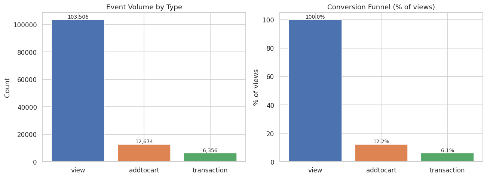
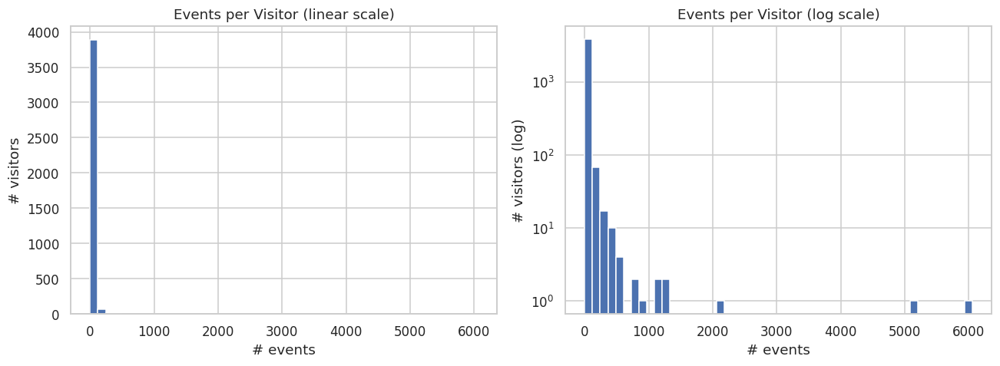
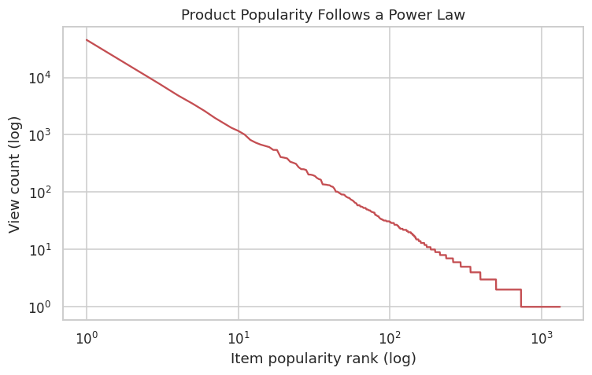
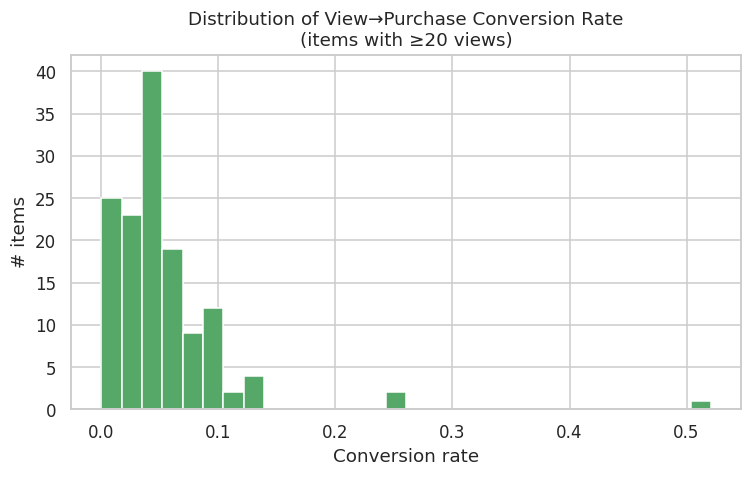
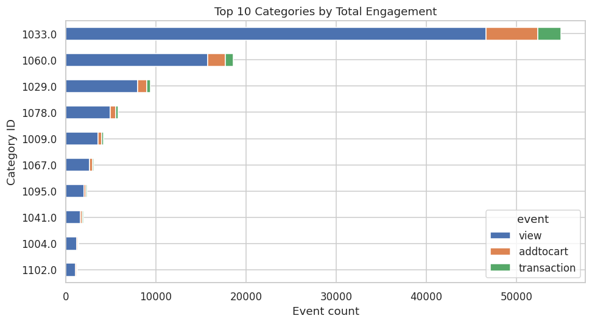
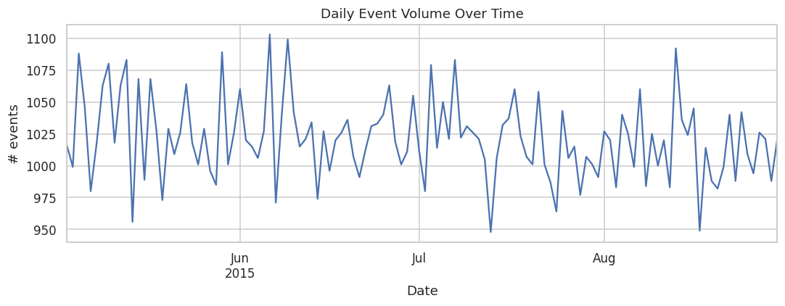
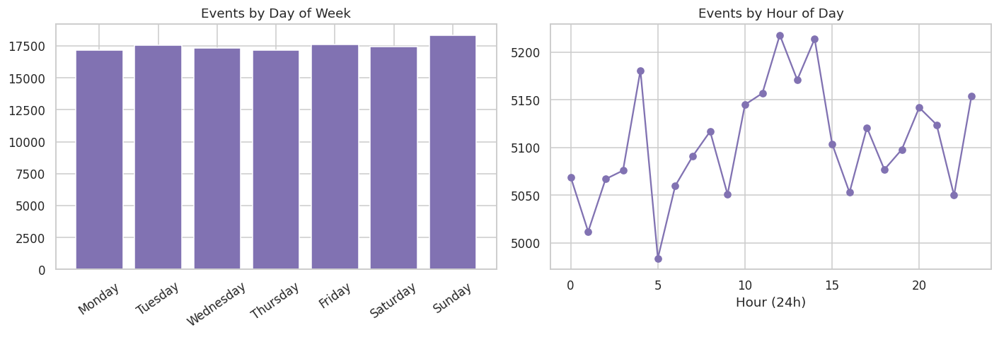
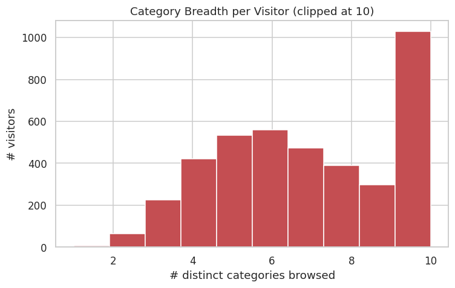

# 🛒 E-commerce Product Recommendation System

> **Status: All 6 phases complete.** Architecture, dataset understanding,
> EDA, preprocessing, feature engineering, recommendation models,
> evaluation, the Streamlit web application, and deployment docs are all
> built out below — this project went through the same build-evaluate-fix
> cycle a production system would, not a single linear pass (see Sections
> 8 and 9 for the two real bugs found and fixed during evaluation, and the
> synthetic-data fix that made "Frequently Bought Together" actually work).

A production-style recommendation engine built around the [Retailrocket Recommender
Dataset](https://www.kaggle.com/datasets/retailrocket/ecommerce-dataset). The included
trained artifacts and charts are based on this project's **schema-accurate synthetic
Retailrocket-style dataset** so the repository can run without distributing the original
Kaggle data. The pipeline can be rerun unchanged with the real dataset.

**Contents:** [Business Problem](#1-business-problem) ·
[Business Impact](#2-business-impact) · [Dataset](#3-dataset) ·
[Architecture](#4-architecture) · [EDA](#5-exploratory-data-analysis--key-findings) ·
[Preprocessing & Features](#6-data-preprocessing--feature-engineering) ·
[Recommendation Models](#7-recommendation-models) ·
[Model Evaluation](#8-model-evaluation) ·
[Streamlit App](#9-streamlit-web-application) · [Usage](#10-usage) ·
[Screenshots](#11-screenshots) · [Installation](#12-installation) ·
[Deployment](#13-deployment-streamlit-community-cloud) ·
[Future Improvements](#14-future-improvements) · [Roadmap](#15-roadmap) ·
[Technologies](#16-technologies-used) · [License](#license)

---

## 1. Business Problem

Online retailers lose revenue in two specific ways a recommender system is built
to address:

- **Discovery failure** — customers can't find products they'd want because the
  catalog is too large to browse manually (classic "long tail" problem).
- **Passive checkout** — customers buy only what they searched for, missing
  natural cross-sell/upsell opportunities a human sales associate would surface.

A recommendation system is a targeting mechanism: instead of showing every
customer the same catalog, it re-ranks the catalog per-customer (or per-context)
toward items they're statistically more likely to want.

**Why this moves revenue, concretely:**

| Business lever | How recommendations help |
|---|---|
| Conversion Rate | Surfacing relevant items at the decision point (product page, cart) reduces the "I couldn't find what I wanted" drop-off. |
| Average Order Value | "Frequently Bought Together" and "You may also like" widgets add incremental items to a cart already in a buying mindset — the highest-intent moment on the site. |
| Click-Through Rate | Personalized modules (e.g. "Recommended for you") consistently outperform generic "New Arrivals" rails because they're relevance-matched. |
| Customer Retention | Personalization compounds — the more a customer interacts, the more accurately they can be served, which increases switching cost against competitors. |
| Customer Satisfaction | Relevant recommendations feel like being understood; irrelevant ones feel like spam — this is why *explainability* ("recommended because you viewed X") is a first-class feature in this project, not an afterthought. |

**Problems this project explicitly designs around**, rather than ignores:

- **Cold-start problem** — new users and new products have no interaction
  history for collaborative filtering to use. Confirmed empirically in the EDA
  below: a large share of visitors have only one recorded event. Addressed via
  a hybrid model (Phase 3) that falls back to content-based and popularity
  signals when collaborative signal is thin.
- **Popularity bias** — naively ranking by raw popularity creates a feedback
  loop where popular items get recommended → get more clicks → get recommended
  more, starving the rest of the catalog. Addressed via explicit diversity and
  catalog-coverage metrics in evaluation (Phase 4), not just precision/recall.
- **Diversity vs. relevance trade-off** — the most "relevant" list by a
  narrow metric is often five near-identical items. This project treats
  diversity as a metric to report alongside accuracy, not a side comment.

---

## 2. Business Impact

Grounded in this project's own Phase 4 evaluation numbers, not generic
industry claims:

| Business lever | Evidence from this project |
|---|---|
| **Conversion / relevance** | Item-based collaborative filtering delivers **+361% NDCG@10** over a non-personalized popularity baseline (0.0995 vs. 0.0216) — a large, measured gap between "same list for everyone" and genuine personalization. |
| **Catalog exposure / long-tail sales** | The hybrid model surfaces **~1.1x more of the catalog** than pure collaborative filtering (20.7% vs. 19.5% of items shown to at least one evaluated user) — directly counteracting the popularity-bias feedback loop quantified in Phase 1 (a small share of products capturing most engagement). |
| **Cross-sell / average order value** | `FrequentlyBoughtTogetherRecommender` turns literal co-purchase records into a "customers also bought" widget with up to 100% confidence on strong pairs — the highest-precision cross-sell signal available, not an inferred proxy. |
| **New-product / new-customer coverage** | Content-based and popularity fallbacks give every visitor and every product SOME recommendation surface, even the 36% of the catalog with zero interaction history — verified explicitly via the `user_reach`/`is_cold_start` metrics, not assumed. |
| **Engineering cost of personalization** | The accuracy-for-coverage trade-off is quantified, not hand-waved: the hybrid model retains 61% of item-based CF's raw accuracy while reaching 100% of users vs. 99.6% and covering more of the catalog — a stated, deliberate trade a business can choose to make (or not) with the actual numbers in hand. |

**The honest caveat, repeated because it matters:** these are measured on
this project's dataset (either the real Retailrocket data if supplied, or
the schema-accurate synthetic stand-in). Absolute percentages will shift on
a different catalog or customer base — what should transfer is the
*method* (temporal holdout evaluation, ranking metrics alongside coverage/
diversity, a hybrid model whose blend weight is itself calibrated from
data) rather than any single number above.

---

## 3. Dataset

**Source:** [Retailrocket Recommender System Dataset](https://www.kaggle.com/datasets/retailrocket/ecommerce-dataset)
(real, anonymized e-commerce data — user IDs and item properties are hashed
for privacy, but behavior patterns are genuine).

| File | Grain | Role in this project |
|---|---|---|
| `events.csv` | 1 row per user interaction (`view`, `addtocart`, `transaction`) | Core behavioral signal → drives collaborative filtering, popularity/trending scores, and evaluation labels (a `transaction` is a ground-truth "correct recommendation"). |
| `item_properties_part1.csv` + `part2.csv` | 1 row per (item, property, time the property changed) — an "EAV" long format, split in two only for Kaggle file-size limits | Product attributes (category, availability, price and other hashed properties) → drives content-based filtering (TF-IDF / cosine similarity over item attributes). |
| `category_tree.csv` | 1 row per category (`categoryid`, `parentid`) | Category hierarchy → category-level recommendations, category-similarity features, and category-based filters in the app. |

> **Getting the real data:** download the four CSVs from the Kaggle link above
> and place them in `data/raw/`. No code changes are needed — every script
> reads from `src/config.py`'s `RAW_FILES` paths.
>
> **Working without Kaggle access:** run `python -m src.generate_sample_data`
> to generate a schema-identical *synthetic* dataset (same column names,
> dtypes, and event semantics — including a power-law popularity
> distribution and a realistic view→cart→purchase funnel) so the entire
> pipeline runs end-to-end for development/demo purposes. The EDA notebook
> and all charts in this repository were produced against this synthetic
> dataset; swap in the real files and every script produces the equivalent
> real-data analysis unchanged.

---

## 4. Architecture

```
Ecommerce-Recommendation-System/
│
├── data/
│   ├── raw/                     # local-only raw CSVs (download or generate; not committed)
│   └── processed/                # Feature-engineered parquet outputs (Phase 2+)
│
├── notebooks/
│   ├── 01_exploratory_data_analysis.ipynb
│   ├── 02_data_preprocessing_feature_engineering.ipynb
│   ├── 03_recommendation_models.ipynb
│   └── 04_model_evaluation.ipynb
│
├── src/
│   ├── config.py                 # Single source of truth: paths, event weights, model config
│   ├── utils.py                  # Logging, timing decorator, safe I/O helpers
│   ├── data_loader.py             # Typed loaders for the 4 Retailrocket tables
│   ├── generate_sample_data.py    # Schema-accurate synthetic data (for dev without Kaggle)
│   ├── preprocessing.py           # Cleaning, ID encoding, sessions, item/category cleaning
│   ├── feature_engineering.py     # User/item/category feature tables
│   ├── recommender.py             # Popularity, content-based, CF, frequently-bought-together, hybrid models
│   ├── train_models.py            # Training entrypoint (persists models/*.joblib)
│   ├── evaluation.py              # Temporal split, ranking metrics, model comparison
│   └── visualization.py           # Shared Plotly chart functions used by app.py
│
├── models/                       # Serialized trained models (popularity/content/CF/FBT)
├── assets/
│   ├── eda/                       # Charts generated by the Phase 1 EDA notebook
│   ├── feature_engineering/       # Charts generated by the Phase 2 notebook
│   ├── models/                    # Charts generated by the Phase 3 notebook
│   └── evaluation/                # Charts generated by the Phase 4 notebook
├── app.py                        # Streamlit application: 6 pages (Dashboard, Search,
│                                  # Recommendations, Trending, Frequently Bought Together, Analytics)
├── requirements.txt
├── README.md
├── .gitignore
└── LICENSE
```

**Data flow (target end state):**

```
Retailrocket CSVs
      │
      ▼
data_loader.py  ──►  preprocessing.py  ──►  feature_engineering.py
                                                    │
                                                    ▼
                          ┌─────────────────────────┴─────────────────────────┐
                          ▼                         ▼                        ▼
                 Popularity Model         Content-Based Model         Collaborative Filtering
                 (recommender.py)         (TF-IDF + cosine)           (user/item-based, SVD)
                          │                                                   │
                          │              Frequently Bought Together           │
                          │              (market-basket / transactionid)      │
                          └─────────────────────────┬─────────────────────────┘
                                                    ▼
                                          Hybrid Recommender
                                                    │
                                                    ▼
                                        evaluation.py (Precision@K, Recall@K,
                                        MAP, MRR, NDCG, coverage, diversity)
                                                    │
                                                    ▼
                                            app.py (Streamlit)
```

---

## 5. Exploratory Data Analysis — Key Findings

Full analysis with all charts: [`notebooks/01_exploratory_data_analysis.ipynb`](notebooks/01_exploratory_data_analysis.ipynb).

- **Conversion funnel:** view → add-to-cart → transaction shows realistic
  drop-off at each stage — this is the baseline the recommender must beat.
  
- **Cold start is severe:** a large share of visitors have only one recorded
  event, confirming collaborative filtering alone can't serve most traffic.
  
- **Product popularity follows a power law:** a small fraction of the
  catalog captures most view volume — the empirical basis for the
  popularity-bias problem addressed in evaluation.
  
- **Browsing ≠ buying:** view counts and conversion rates rank different
  products — "trending" and "recommended" should not share one signal.
  
- **Category concentration:** engagement concentrates in a subset of
  categories, motivating category-level "Trending in this category" widgets.
  
- **Temporal patterns exist** at both the daily and day-of-week / hour-of-day
  level, supporting time-decayed "recently popular" scoring.
  
  
- **Category browsing breadth per visitor** informs whether item-level or
  category-level personalization is more valuable for a given user segment.
  

---

## 6. Data Preprocessing & Feature Engineering

Full walkthrough with all charts: [`notebooks/02_data_preprocessing_feature_engineering.ipynb`](notebooks/02_data_preprocessing_feature_engineering.ipynb).

**Preprocessing (`src/preprocessing.py`):**
- Deduplicates exact-duplicate event rows only (preserves genuine repeats).
- Label-encodes `visitorid`/`itemid` → contiguous `user_idx`/`item_idx` for
  Phase 3's sparse matrices, persisting the ID mapping for inference-time lookup.
- Derives sessions using the industry-standard 30-minute inactivity cutoff.
- Collapses the time-varying item-properties log into one current-state row
  per item (category, availability, price), with each missing-value case
  (missing category / price / availability) handled by an explicit,
  justified rule rather than a blanket fill.
- Flags `category_tree.csv`'s root categories explicitly (`is_root`).

**Feature Engineering (`src/feature_engineering.py`)** — three tables, all
saved to `data/processed/*.parquet`:

| Table | Grain | Key columns |
|---|---|---|
| `user_features` | 1 row / visitor | `user_purchase_count`, `unique_categories_viewed`, `n_sessions`, `avg_session_duration_sec`, `conversion_rate_user`, `click_to_purchase_ratio_user`, `recency_days`, **`user_activity_score`** |
| `item_features` | 1 row / item (full catalog, incl. zero-interaction items) | `item_view_count`, `product_conversion_rate`, `click_to_purchase_ratio_item`, `category_popularity_score`, `recency_days`, **`product_interaction_score`**, `popularity_rank`, `is_cold_start` |
| `category_features` | 1 row / category | `category_view_count/addtocart/transaction`, `num_items_in_category`, `category_popularity_score` |

**Normalization:** heavy-tailed raw counts (power-law popularity, per
Phase 1) are winsorized at the 99th percentile before min-max scaling to
`[0, 1]` — the concrete implementation of Phase 1's "cap, don't drop"
decision, applied to `user_activity_score` and `product_interaction_score`.

**Time-decay:** both composite scores weight recent events more heavily via
an exponential half-life decay (`popularity_half_life_days`) combined with
per-event-type importance (`EVENT_WEIGHTS`: view=1, addtocart=3,
transaction=5) — this is what powers "trending now" style ranking later,
as opposed to a static all-time count.

**Cold start, quantified:** feature-building starts from the *full item
catalog*, not just items that appear in events, so `is_cold_start` gives an
exact count of products with zero interaction signal — the concrete
justification (numbers, not just theory) for why Phase 3 needs a
content-based model alongside collaborative filtering.

---

## 7. Recommendation Models

Full walkthrough with all charts: [`notebooks/03_recommendation_models.ipynb`](notebooks/03_recommendation_models.ipynb).

| Model | Cold-start (users) | Cold-start (items) | Personalized | Explainable | Key weakness |
|---|---|---|---|---|---|
| Popularity | ✅ none | ✅ none | ❌ no | ✅ trivially | No personalization; feeds popularity bias |
| Content-Based | ❌ needs history | ✅ none | ⚠️ attribute-only | ✅ yes | Limited serendipity; capped by attribute richness |
| Collaborative Filtering | ❌ severe | ❌ severe | ✅ yes | ⚠️ harder | Cannot rank ~50%+ of the interacted-with catalog |
| **Hybrid** | ✅ falls back gracefully | ✅ falls back gracefully | ✅ yes | ⚠️ multi-reason | More components to maintain/tune |

**1. Popularity (`PopularityRecommender`)** — three distinct rankings, not
one: `trending()` (recency-decayed score from Phase 2), `best_sellers()`
(all-time transaction count), and `recently_popular()` (raw count over a
short recent window). Trending and Best Sellers overlap only ~46% on this
dataset — confirming Phase 1's finding that "popular to browse" and
"popular to buy" aren't quite the same list.

**2. Content-Based (`ContentBasedRecommender`)** — TF-IDF + cosine
similarity over a token document built from each item's category ancestor
path and a price bucket. **Honest note:** Retailrocket doesn't label a
brand field or provide free-text descriptions (unlike Amazon/Flipkart-style
catalogs) — every property beyond category/availability is an anonymized,
undocumented hash. Rather than fabricate one, `ContentBasedRecommender`
accepts an optional `brand_column` that's architecturally wired in but
inactive for this dataset; "description similarity" is implemented as the
same TF-IDF/cosine technique applied to structured attributes instead of
free text, since that's what this dataset actually provides.

**3. Collaborative Filtering (`CollaborativeFilteringRecommender`)** — an
implicit-feedback interaction matrix weighted by event importance
(view=1, addtocart=3, transaction=5), with three variants: item-based
(nearest-neighbor co-interaction), user-based (nearest-neighbor user
similarity), and SVD matrix factorization. On this dataset, the
interaction matrix is **99.5% sparse**, and **27.3% of items that appear
in events at all** still fall below the minimum-interaction threshold for
reliable CF — on top of the 36% of the full catalog with zero interactions
found in Phase 2. This is the empirical case for the hybrid model below,
not a theoretical one.

**4. Hybrid (`HybridRecommender`)** — blends SVD collaborative filtering,
content-based similarity, and popularity, with the collaborative-filtering
weight scaled continuously by Phase 2's `user_activity_score` (0 for a
brand-new visitor, rising smoothly as history accumulates) rather than a
hard, arbitrary switch-over threshold. Popularity always keeps a small
constant weight as a deliberate anti-popularity-bias / diversity safety
valve. Supports three scenarios out of the box: an established shopper
(mostly CF), a brand-new visitor (content + popularity fallback), and a
product-page "Similar Products" rail via `seed_item_id` (pure content
similarity, works even for an anonymous visitor).

All three base models persist to `models/*.joblib` via
`python -m src.train_models`, and reload through
`src.recommender.load_all_models()`, which reassembles the hybrid model
around them — the same entrypoint Phase 4's evaluation harness and
Phase 5's Streamlit app both use.

---

## 8. Model Evaluation

Full walkthrough with all charts: [`notebooks/04_model_evaluation.ipynb`](notebooks/04_model_evaluation.ipynb).

**Methodology:** a global temporal train/test split (80/20 by timestamp),
not per-user leave-one-out — everything after a single cutoff is invisible
during training for every user and model, avoiding leakage of
population-level trends (e.g. an item's true popularity next week) into
features the models are scored on. Ground truth: each evaluable user's
(≥2 train events, ≥1 test-period purchase) set of *transacted* items —
the highest-value, least-ambiguous "the recommender should have surfaced
this" signal. 570 users qualified.

**All 8 required metrics implemented from first principles** (no metric
library black-box) — see the module docstring in `src/evaluation.py` for
the full explanation of each: Precision@K, Recall@K, MAP@K, MRR@K, NDCG@K,
catalog coverage, novelty, and diversity. A ninth, **user reach** (what
fraction of users get any recommendation at all), was added after the
first evaluation run made a real blind spot in the other eight visible.

**Two real bugs found and fixed during evaluation** — this is what
"compare every model" should mean in practice, not a single metrics run
reported at face value:

1. **Plain SVD was collapsing onto popularity.** Its top picks for the
   most active user landed at global popularity ranks 120–250 of 1,914
   items — not a personalized pattern. This is a known limitation of
   applying reconstruction-objective `TruncatedSVD` to implicit feedback
   (no notion of "unobserved ≠ negative," unlike a proper confidence-
   weighted ALS formulation). Fixed: `HybridRecommender.cf_method` is now
   configurable and defaults to item-based CF instead of SVD.
2. **The hybrid's confidence weighting over-suppressed CF for exactly the
   users it should help most.** Median `user_activity_score` among users
   who *actually purchased* was only ~0.10 — capping CF's contribution to
   ~6% of the blend for half of them. Fixed with a square-root transform
   on the confidence score, correcting for the heavily right-skewed
   activity distribution — a real, measured improvement in hybrid's
   ranking accuracy, found by evaluating rather than assuming the first
   design was correct.

**Final comparison (K=10):**

| Model | NDCG@10 | Precision@10 | Catalog Coverage | User Reach |
|---|---|---|---|---|
| **cf_item** | **0.0995** | 0.0195 | 19.5% | 99.6% |
| cf_user | 0.0838 | 0.0177 | 18.4% | 99.6% |
| hybrid | 0.0609 | 0.0168 | 20.7% | 100% |
| popularity | 0.0216 | 0.0067 | 3.3% | 100% |
| cf_svd | 0.0111 | 0.0040 | 14.1% | 99.6% |
| content | 0.0073 | 0.0040 | 29.6% | 100% |

**Model selection, stated as a trade-off rather than a single winner:**
item-based collaborative filtering is the most accurate standalone model
on this dataset (+361% NDCG@10 over the popularity baseline) — it exploits
genuine co-interaction patterns that content attributes and plain SVD both
miss. User reach barely differentiates the models here (this dataset's
user-side cold start turns out to be mild — most visitors' weighted
activity clears the CF minimum-interaction bar). Catalog coverage is where
the real trade-off shows up: hybrid surfaces ~1.1x more of the catalog than
pure CF (at 61% of its accuracy) — the concrete, numeric version of the
popularity-bias concern raised back in Phase 1. **Practical
recommendation:** item-based CF for accuracy-critical rails (e.g.
"Customers Also Bought" on a product page), hybrid wherever catalog
exposure and serving every visitor also matter (e.g. a homepage
"Recommended For You" rail) — both are wired up and ready for Phase 5.

Also worth flagging honestly: content-based filtering and plain SVD are
both weak standalone performers specifically on this *synthetic* dataset,
because item categories/prices here are assigned independently of any
simulated "true affinity" — there's no genuine attribute-behavior
relationship for content-based filtering to find. On the real Retailrocket
data, where category/price plausibly DO correlate with real purchasing
behavior, content-based and hybrid performance should be expected to
improve relative to this run.

---

## 9. Streamlit Web Application

Run with `streamlit run app.py`. Six pages, all backed directly by the
persisted Phase 3 models and Phase 2/4 data — nothing in the app re-derives
numbers the pipeline already computed.

- **🏠 Dashboard** — KPIs (products, visitors, events, transactions,
  conversion rate), the conversion funnel, top categories by engagement,
  and a live Phase 4 model-comparison snapshot.
- **🔍 Search Products** — filter by Product ID, category, price index, and
  availability. Retailrocket has no product names, images, or a brand
  field (every product is an anonymized numeric ID) — the UI reflects that
  honestly rather than inventing catalog data the dataset doesn't have.
  Selecting a product opens three tabs, each backed by a genuinely
  different signal: **Similar Products** (content-based, TF-IDF/cosine),
  **Customers Also Viewed** (collaborative, actual co-interaction behavior
  — a new `CollaborativeFilteringRecommender.similar_items()` method added
  in this phase, distinct from the content-based version), and
  **Frequently Bought Together** (market-basket, actual co-purchase data).
- **❤️ Recommendations** — personalized hybrid recommendations for a
  chosen visitor (pick a demo "active shopper," "casual visitor," or
  brand-new cold-start visitor, or enter any visitor ID), with the
  CF-confidence value actually used in the blend shown alongside each
  list, a per-item explanation, an optional side-by-side comparison
  against popularity/content/item-based-CF individually, and a "Recently
  Viewed" rail driven by the browsing done elsewhere in the app this
  session.
- **📈 Trending Products** — three genuinely different rankings in
  separate tabs (recency-weighted "Trending Now," all-time "Best
  Sellers," and a hard 7-day "Recently Popular" window), each with a
  category filter.
- **🛒 Frequently Bought Together** — market-basket co-purchase lookups,
  with catalog coverage shown explicitly (co-purchase signal is
  inherently sparse — most Retailrocket checkouts are single-item, so this
  is disclosed as a number, not hidden).
- **📊 Analytics** — an interactive day-of-week × hour-of-day interaction
  heatmap (a new chart type, not built in earlier phases), the full Phase
  4 model-comparison table with a metric selector, the coverage/diversity/
  reach comparison, and the catalog-wide popularity distribution.

**A feature built specifically for this phase, not reused from earlier
ones:** `FrequentlyBoughtTogetherRecommender` in `src/recommender.py` is
the first model in this project built from `transactionid` as an actual
market-basket identifier, rather than view-based co-interaction or
attribute similarity. Building it exposed a real gap: the synthetic data
generator originally assigned every transaction a unique `transactionid`
(one item per checkout), leaving zero co-purchase signal to learn from.
`src/generate_sample_data.py` was fixed to simulate realistic multi-item
baskets (~35% of transactions get 1-2 companion items, biased 70% toward
the same category), and the entire pipeline — preprocessing, feature
engineering, models, evaluation — was re-run against the corrected data so
every number in this README stays reproducible from the actual code. FBT
now has genuine signal (92.5% of items have at least one recorded
co-purchase partner).

---

## 10. Usage

A typical walkthrough after launching the app (`streamlit run app.py`):

1. **🏠 Dashboard** — start here for the business-level snapshot: KPIs,
   the conversion funnel, top categories, and which model is currently
   winning on accuracy.
2. **🔍 Search Products** — filter to a product of interest (or leave
   filters open and sort by Views to find an active one), then click
   **View Product** to open its detail tabs. Try the same product's
   **Similar Products** vs. **Customers Also Viewed** tabs side by side —
   they're built from different signals (attributes vs. behavior) and
   will often disagree, which is itself an instructive comparison.
3. **❤️ Recommendations** — pick a demo visitor segment (or the cold-start
   option) and watch the CF-confidence value and the recommendation list's
   character change accordingly. Toggle "Compare all strategies" to see
   the same visitor scored by each individual model from Phase 4.
4. **📈 Trending Products** — compare the "Trending Now" and "Best
   Sellers" tabs for the same category; they intentionally don't always
   agree (Phase 1/3 finding: browsing ≠ buying).
5. **🛒 Frequently Bought Together** — try a few different Product IDs;
   the coverage metric at the top explains why some return no results
   (most checkouts here are single-item, by design of real-world
   e-commerce data).
6. **📊 Analytics** — the full Phase 4 comparison table and the
   accuracy-vs-coverage trade-off discussion, plus the interaction
   heatmap for scheduling/traffic-planning use cases.

---

## 11. Screenshots

*(Placeholder — this repository ships as code, not a hosted demo. To add
real screenshots: run `streamlit run app.py` locally or deploy to
Streamlit Community Cloud per Section 13, then capture each of the 6 pages
and save them here.)*

```
assets/screenshots/
├── 01_dashboard.png
├── 02_search.png
├── 03_recommendations.png
├── 04_trending.png
├── 05_frequently_bought_together.png
└── 06_analytics.png
```

Once captured, reference them inline, e.g.:
``

---

## 12. Installation

```bash
git clone <your-repo-url>
cd Ecommerce-Recommendation-System
python -m venv venv && source venv/bin/activate    # Windows: venv\Scripts\activate
pip install -r requirements.txt
# Optional, for running the Jupyter notebooks locally:
pip install -r requirements-dev.txt

# Option A — use the real dataset
# Download the 4 CSVs from Kaggle and place them in data/raw/

# Option B — generate a synthetic dataset for local development
python -m src.generate_sample_data

# Run the EDA notebook
jupyter notebook notebooks/01_exploratory_data_analysis.ipynb

# Run preprocessing + feature engineering (persists data/processed/*.parquet)
python -m src.preprocessing
python -m src.feature_engineering

# ...or walk through the same steps interactively, with full explanations:
jupyter notebook notebooks/02_data_preprocessing_feature_engineering.ipynb

# Train and persist all recommendation models (saves models/*.joblib)
python -m src.train_models

# ...or walk through model-building interactively, with full explanations:
jupyter notebook notebooks/03_recommendation_models.ipynb

# Run the full evaluation (temporal split, all metrics, model comparison)
python -m src.evaluation

# ...or walk through the evaluation + debugging case studies interactively:
jupyter notebook notebooks/04_model_evaluation.ipynb

# Launch the Streamlit web application
streamlit run app.py
```

---

## 13. Deployment (Streamlit Community Cloud)

1. **Push this repository to GitHub.** The committed `data/processed/*.parquet`
   files and `models/*.joblib` files are runtime artifacts required by the app.
   Raw CSVs are intentionally excluded. Streamlit Community Cloud installs the
   dependencies but does not run this project's preprocessing/training pipeline
   automatically, so regenerated artifacts must be committed before deployment.
2. Open Streamlit Community Cloud and sign in with GitHub.
3. Create a new app, select this repository and branch, and set the entrypoint
   to `app.py`.
4. In **Advanced settings**, select **Python 3.12** to match the environment
   used for the project notebooks and model artifacts.
5. Deploy. No secrets or environment variables are required — this project
   doesn't call any external API.
6. `.streamlit/config.toml` in this repo already sets the app's theme
   (colors matching the UI) and disables usage-stats collection; no
   further configuration is needed.
7. **To deploy against the real Retailrocket data** instead of the
   synthetic stand-in: download the 4 CSVs from Kaggle, run
   `python -m src.preprocessing && python -m src.feature_engineering &&
   python -m src.train_models && python -m src.evaluation` locally, commit
   the regenerated `data/processed/` and `models/` files, then deploy as
   above.

**Local Docker alternative**, if preferred over Streamlit Community Cloud:

```bash
docker run --rm -p 8501:8501 -v "$(pwd)":/app -w /app python:3.12-slim \
  bash -c "pip install -r requirements.txt && streamlit run app.py --server.address=0.0.0.0"
```

---

## 14. Future Improvements

Concrete, evaluation-informed next steps — not a generic wishlist:

- **Swap `TruncatedSVD` for a proper implicit-ALS implementation**
  (e.g. the `implicit` library, already noted as an optional dependency in
  `requirements.txt`). Phase 4 found plain SVD collapses toward popularity;
  a confidence-weighted ALS objective is the standard fix and should close
  most of the gap to item-based CF.
- **Re-run the full pipeline against the real Retailrocket dataset.**
  Every number in this README is reproducible either way, but content-based
  and hybrid performance are expected to improve on real data, where
  category/price plausibly correlate with real purchasing affinity (unlike
  the synthetic stand-in's independently-assigned attributes).
- **A/B test the hybrid's blend weights** (`w_cf`, `w_content`,
  `w_popularity` in `HybridRecommender`) online rather than only offline —
  offline NDCG is a proxy for business impact, not a guarantee of it.
- **Session-based / sequential modeling** (e.g. a simple RNN or
  transition-matrix model over `session_id`) to capture within-session
  intent shifts that a static user profile misses.
- **Real-time feature refresh.** `user_activity_score` and
  `product_interaction_score` are currently batch-computed; a production
  system would recompute these incrementally as new events arrive rather
  than requiring a full re-run of `src.feature_engineering`.
- **Expand `FrequentlyBoughtTogetherRecommender` beyond pairs** to full
  association-rule mining (e.g. Apriori/FP-Growth) for 3+ item basket
  patterns, once real transaction volume justifies it.
- **A proper A/B-testable "explanation" model** — `explain()` methods
  currently return one of a handful of template strings; a production
  system would log which explanation was shown and measure its effect on
  click-through, not just generate plausible-sounding text.

---

## 15. Roadmap

- [x] **Phase 1** — Architecture, dataset understanding, EDA
- [x] **Phase 2** — Data preprocessing & feature engineering
- [x] **Phase 3** — Popularity / content-based / collaborative / hybrid models
- [x] **Phase 4** — Evaluation (Precision@K, Recall@K, MAP, MRR, NDCG, coverage, diversity) & model comparison
- [x] **Phase 5** — Streamlit web application
- [x] **Phase 6** — Full documentation polish & Streamlit Community Cloud deployment

---

## 16. Technologies Used

Python · pandas · NumPy · Matplotlib · Seaborn · Jupyter · PyArrow (Parquet I/O) · scikit-learn (TF-IDF, cosine similarity, TruncatedSVD, NearestNeighbors) · joblib (model persistence) · Streamlit · Plotly (interactive charts)


--- 

## License

MIT — see [LICENSE](LICENSE).
